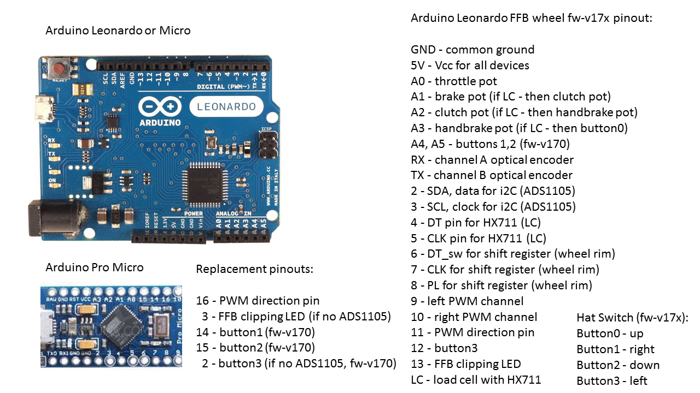
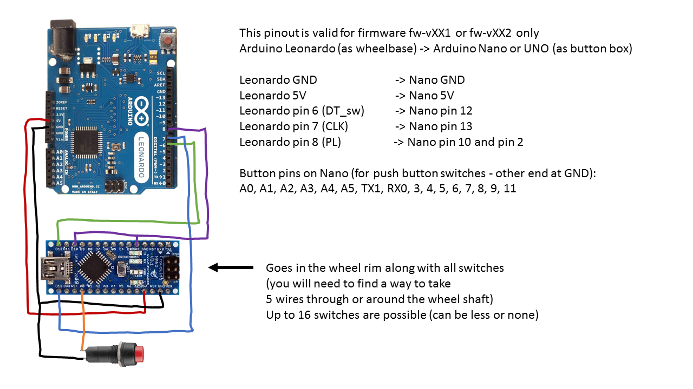

# Arduino-FFB-wheel
Stand alone USB device recognized as a joystick with force feedback functionality, based on BR Wheel by Fernando Igor from 2017.

Some firmware features:
- suported boards: Leonardo, Micro, Pro Micro
- 4axis + 1 for optical encoder
- 28 buttons
- fully supported 16bit FFB effects
- FFB calculation rate 500Hz
- many options available (external 12bit ADC/DAC, pedal autocalibration, z-index, hatswitch)
- serial interface for configuration of all wheel parameters
- fully adjustable PWM or DAC outputs
- load cell support for HX711
- wheel control user interface for an easy configuration and monitoring of all inputs

Firmware v17x pinouts

Button box firmware pinouts

