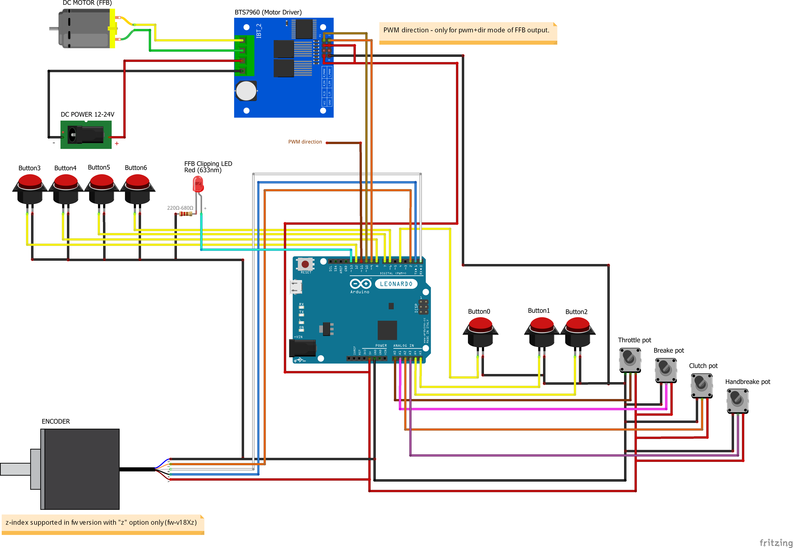
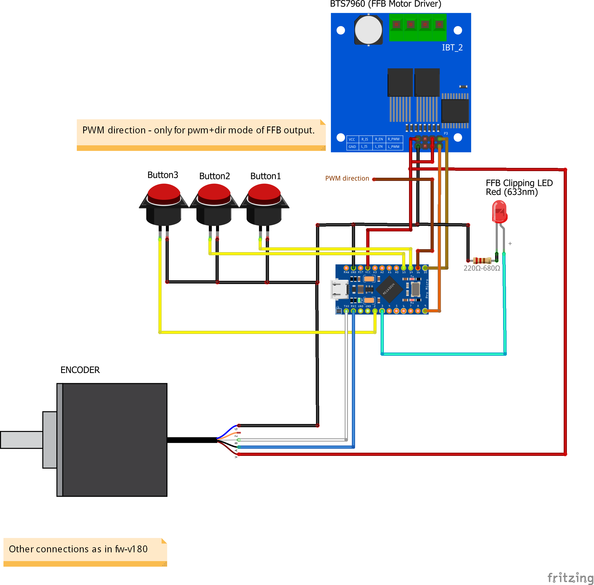
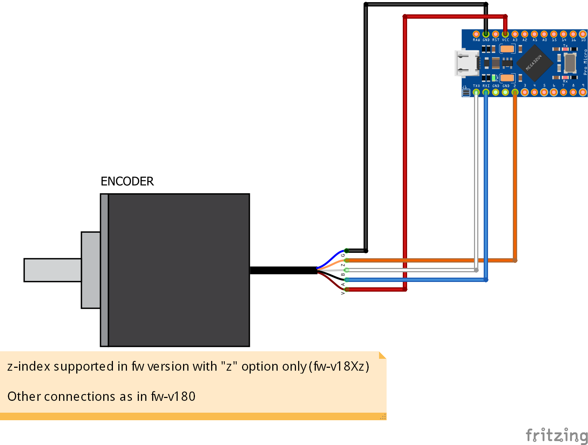
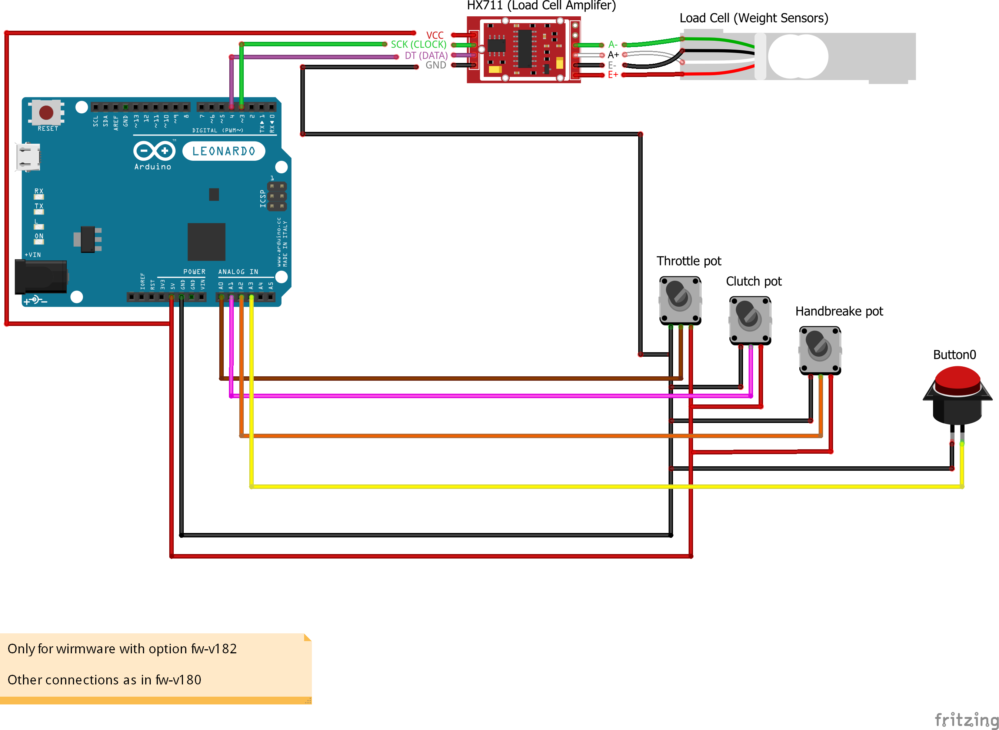
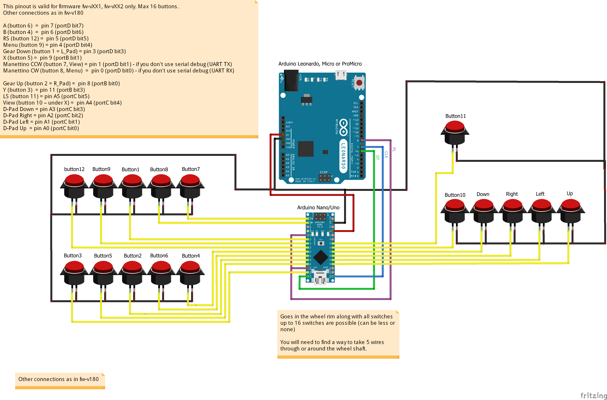
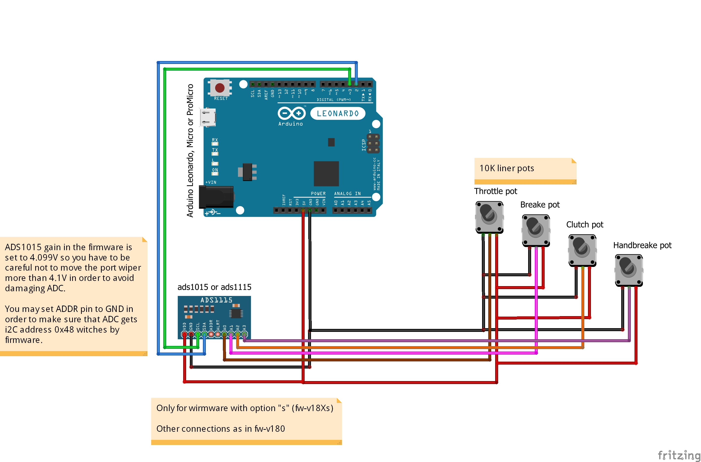
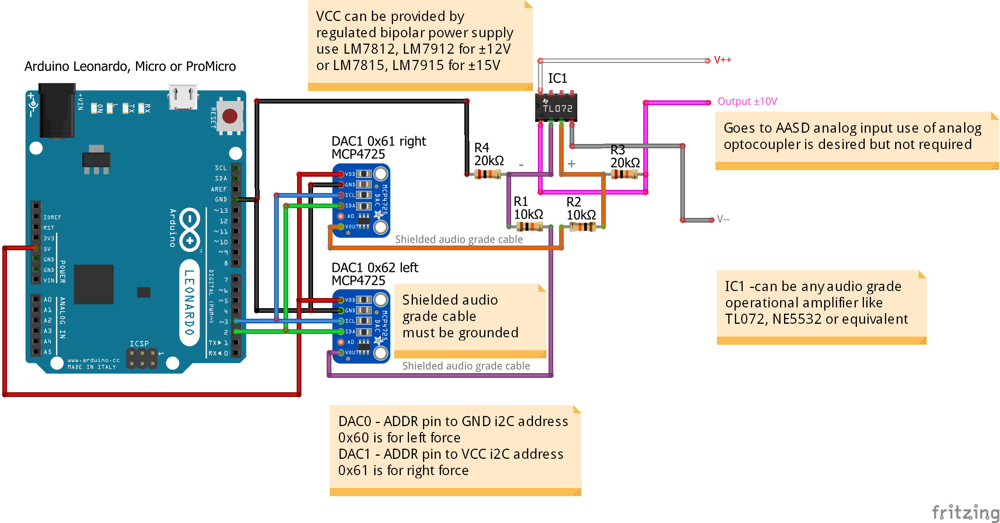

# Arduino-FFB-wheel

Stand alone USB device recognized as a joystick with force feedback functionality, based on BRWheel by Fernando Igor from 2017.

**Firmware features:**

- supported Arduino boards: Leonardo, Micro and ProMicro (5V, 16MHz)
- 4 analog axis + 1 for optical encoder, 2 FFB axis (only 1 has pwm or dac output)
- 16 buttons via button box firmware uploaded to Arduino Nano/Uno
- fully supported 16bit FFB effects (custom force effect not implemented)
- envelope and conditional block effects, start delay, durration, deadband
- FFB calculation and axis/button update rate is 500Hz (2ms period)
- many options available (external 12bit ADC/DAC, pedal autocalibration, z-index, hatswitch)
- RS232 serial interface for configuration of all wheel parameters
- fully adjustable FFB output in the form of 2channel digital PWM or analog DAC signals
- load cell support for HX711 chip (for brake pedal axis only)
- all wheel parameters are stored in EEPROM (and automatically loaded at each powerup)
- wheel control user interface for an easy configuration and monitoring of all inputs/outputs

**Firmware options (firmware version include some letter after 2 or 3 digit number):**

- **`a`** - pedal auto calibration enabled
- **`b`** - wheel calibration enabled at startup and no pedal auto calibration
- **`z`** - encoder z-index support
- **`h`** - enabled Hat Switch (uses first 4 buttons from button box)
- **`s`** - enabled external 12bit ADC - ADS1105 (for analog inputs)
- **`d`** - enabled external 12bit DAC - MCP4725 (for analog FFB output)
- **`m`** - replacement pinouts for ProMicro (for FFB clipping LED and buttons 3,4)

Detailed documentation and more information about the firmware can be found in **txt** files inside *[brWheel_my folder](./brWheel_my/)*.

A ***[GUI](https://github.com/ranenbg/Arduino-FFB-gui)*** tool is used to set up and calibrate the steering wheel and pedals.

## Firmware pinouts and wiring diagrams

- **PWM direction** - Some motor drivers like brushless, H-bridge or AASD for servo motors have the input defined as pwm signal and direction signal. For that use case I made *pwm+dir* mode of FFB output, where pin 9 provides pwm signal and pin 11 provides a direction signal.

### The basic wiring diagram is shown on the example *fw‑v180z*

### The diagram for Arduino ProMicro *fw‑v180m*

### The diagram for Arduino ProMicro with encoder z-index support *fw‑v180zm*

### The diagram for connection load cell with HX711 chip (for brake pedal axis only) *fw‑v181*

### Button box firmware pinouts - for Arduino Nano/Uno *[tx_rw_ferrari_458_wheel_emu_16buttons.ino](./tx_rw_ferrari_458_wheel_emu_16buttons/tx_rw_ferrari_458_wheel_emu_16buttons.ino)*

### Wiring diagram for external ADC (only valid for firmware with option "s")

### Wiring diagram for external DAC`s (only valid for firmware fw-vXX3, in DAC± mode)

## Firmware download

- ***[Latest Release](https://github.com/ranenbg/Arduino-FFB-wheel/releases/latest)***
- ***[Past Versions](https://github.com/ranenbg/Arduino-FFB-wheel/releases)***

## Firmware upload procedure
You can use XLoader https://github.com/xinabox/xLoader:
- set 57600baud, ATMega32U4 microcontroler and select desired HEX
- press reset button on Arduino (or shortly connect RST pin to GND)
- select newly appeared COM port (Arduino in bootloader mode*) and press upload (you will only have a few seconds)

*It is possible that some cheap chinese clones of Arduino Leonardo, Micro or ProMicro do not have a bootloader programmed. In that case you need to upload the original Arduino Leonardo bootloader first. You can find more details about it here: https://docs.arduino.cc/built-in-examples/arduino-isp/ArduinoISP

## Credits

Original BRWheel firmware by: Tero Loimuneva, Saku Kekkonen, Etienne Saint-Paul and Fernando Igor.
https://github.com/fernandoigor/BRWheel/tree/alphatest
